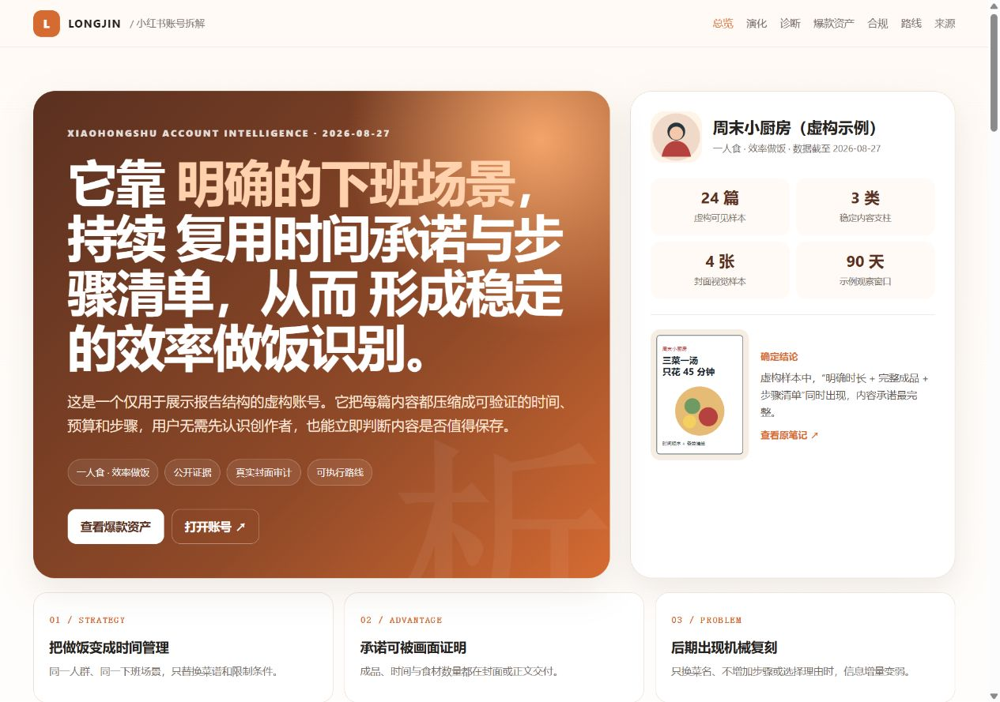

<div align="center">

# xhs-chaijie-dsh

**把一个小红书账号的增长逻辑，拆成可验证证据与可执行动作。**

DSH 原生 · 真实封面审计 · 爆款资产复用 · 单页可视化报告

[](#安装到-dsh)
[](LICENSE)
[](#维护者)

</div>

## 它解决什么

给出 1-5 个小红书账号主页链接，Skill 会读取公开主页、笔记、互动与真实封面，回答账号为什么能做起来、什么内容有效、如何演化、哪些方法能复制，以及下一步应该做什么。正式分析后默认生成一个可直接打开的单页 HTML 报告，不需要再追问“能不能可视化”。

它也能先帮你找对标。定位没有说清前不会凭行业印象编账号；候选会区分“站内已验证”和“外部搜索待验证”。

## 核心能力

| 能力 | 交付内容 |
|---|---|
| 账号定位 | 人群、场景、长期承诺与核心增长策略 |
| 内容诊断 | 定位、选题、标题、封面、内容价值与主页承接 |
| 真实封面审计 | 封面文字、主体、构图、色彩、钩子、证据与可复制点 |
| 账号演化 | 带日期的探索、转折、稳定阶段与关键保留 |
| 爆款资产复用 | 首个高热、后续变体、数据波动和选题/标题/封面公式 |
| 对标与路线 | 学什么、不学什么、起号基建、验证固化、放大扩展 |
| 合规与证据 | 只使用公开或授权材料，明确事实、推断和缺失字段 |
| 可视化报告 | 响应式、自包含、可离线打开的 7 章 HTML 报告 |

## 报告长什么样

仓库附带一份完全虚构、不会复用用户信息的[示例报告](examples/sample_report.html)。报告固定包含：一分钟结论、账号演化、内容诊断、爆款资产复用、合规边界、发展路线、数据说明与来源。



正式报告会从真实账号封面提取主题色，不固定套用小红书红。

## 安装到 DSH

DSH 会扫描用户级 `~/.dsh/skills` 和项目级 `.dsh/skills`。仓库根目录本身就是可安装 Skill，不要再多套一层目录。

### 最快方式：直接克隆

Windows PowerShell：

```powershell
$skillsDir = Join-Path ([Environment]::GetFolderPath('UserProfile')) '.dsh\skills'
New-Item -ItemType Directory -Path $skillsDir -Force | Out-Null
git clone https://github.com/kingselyjoe/xhs-chaijie-dsh.git (Join-Path $skillsDir 'xhs-chaijie-dsh')
```

macOS / Linux：

```bash
mkdir -p "${DSH_HOME:-$HOME/.dsh}/skills"
git clone https://github.com/kingselyjoe/xhs-chaijie-dsh.git "${DSH_HOME:-$HOME/.dsh}/skills/xhs-chaijie-dsh"
```

### 方式一：下载后运行安装脚本

Windows PowerShell：

```powershell
Set-ExecutionPolicy -Scope Process Bypass
.\scripts\install.ps1
```

macOS / Linux：

```bash
chmod +x scripts/install.sh
./scripts/install.sh
```

脚本默认安装到 `~/.dsh/skills/xhs-chaijie-dsh`。已有同名目录时会停止，避免静默覆盖；PowerShell 可在检查旧版本后使用 `-Force`，旧目录会先备份。

### 方式二：直接放入项目

把整个仓库复制到：

```text
你的项目/.dsh/skills/xhs-chaijie-dsh/
```

确认最终入口是：

```text
你的项目/.dsh/skills/xhs-chaijie-dsh/SKILL.md
```

安装后重启 DSH 或开启新会话，让它重新扫描 Skills。

## 使用方式

直接拆账号：

```text
拆解这个小红书账号：https://www.xiaohongshu.com/user/profile/...
```

横向对比：

```text
对比这 3 个小红书账号，找出最值得新号复制的内容结构：
<主页链接 1>
<主页链接 2>
<主页链接 3>
```

先找对标：

```text
我要做一个面向一线城市新手爸妈的辅食账号，真人演示，目标是店铺下单。先帮我找 5 个对标。
```

有链接时 Skill 会直接开始，不强制你先填写定位问卷。只有“找对标”模式才补齐必要画像。

## DSH 兼容设计

- 使用 DSH 可发现的根目录 `SKILL.md` 与 kebab-case 名称。
- 默认允许模型自动调用，也支持用户显式调用。
- 不绑定某个浏览器插件或固定本机路径；运行时按真实能力协商。
- 优先使用用户已授权的本地登录会话，不索要密码或完整 Cookie。
- 浏览器、视觉或预览不可用时会继续寻找宿主能力，再提供材料降级方案。
- HTML、CSS 与 JavaScript 自包含，不依赖 CDN、npm 或网络字体。

## 项目结构

```text
xhs-chaijie-dsh/
├─ SKILL.md                       # DSH 入口与完整执行工作流
├─ assets/report-template.html    # Longjin 可视化报告模板
├─ references/                    # 分析、规则、报告与工具路由
├─ scripts/                       # 安装、诊断、示例构建与验证
├─ examples/                      # 虚构数据示例报告
├─ tests/                         # 自动化测试
├─ LICENSE
└─ NOTICE
```

## 自检与开发

```bash
python scripts/doctor.py
python scripts/build_demo.py
python scripts/validate_skill.py
python scripts/validate_report_links.py examples/sample_report.html
```

仓库 CI 会在 Windows 与 Ubuntu 上验证 DSH 元数据、必备资源、七章报告结构、外链安全和本地图片。

## 隐私与合规

- 只分析公开可见内容或用户主动提供的数据。
- 不绕过登录、验证码、权限、频控或平台风控。
- 不编造曝光、点击率、完播率、成交、转化率或涨粉数据。
- 没看见真实封面时不猜视觉元素。
- 示例账号与数据完全虚构，不使用当前用户的履历、公司、城市或历史对话。
- 平台规则会更新，高风险行业与商业合作结论应在执行时核对官方页面。

## 从一次拆解，到持续增长：xhs-chaijie-dsh-pro

当前开源版已经能完成高质量的单次账号拆解。规划中的 `xhs-chaijie-dsh-pro` 不只是“多分析几个账号”，而是把**对标研究、内容生产、发布协作和效果复盘串成一套可持续运行的小红书内容操作系统**。

> 开源版回答“这个账号为什么有效”；Pro 版进一步回答“我的团队今天该做什么、下周如何验证、哪些方法值得继续投入”。

### Pro 计划包含什么

| 能力模块 | Pro 版计划交付 |
|---|---|
| 批量账号情报 | 建立可配置的账号池，批量拆解竞品、达人和自有账号；统一比较定位、更新节奏、内容支柱、封面结构、爆款率与演化路径 |
| 竞品动态追踪 | 周期性记录账号变化，识别新栏目、新选题、新视觉和增长拐点；把“偶尔看同行”升级为持续情报监测 |
| 爆款资产库 | 沉淀首发爆款及后续变体，按人群、场景、需求、标题、封面、内容结构和转化动作检索，保留每条结论的证据来源 |
| 趋势与机会雷达 | 聚合公开趋势、搜索线索与账号样本，发现正在上升的需求、拥挤赛道和内容空位，输出值得测试的机会清单 |
| 品牌策略大脑 | 保存品牌定位、产品卖点、目标人群、语气、禁用表达和历史结论，让不同成员生成的内容仍保持统一 |
| 内容生产流水线 | 从策略自动展开到选题池、标题变体、封面 Brief、正文/口播初稿、评论区承接和发布前检查，形成可编辑的内容包 |
| 发布协作工作流 | 生成内容日历、负责人、素材状态与发布清单；在用户授权且平台规则允许的前提下，接入已有发布工具或保留人工确认节点 |
| 数据复盘闭环 | 导入用户授权的运营数据，将曝光、点击、互动、涨粉、咨询或成交与内容公式对应，给出继续、调整、停止的下一轮实验建议 |
| 商业化拆解 | 分析种草路径、产品露出、信任建立、主页承接与转化动作，形成适用于品牌、自媒体和服务型业务的商业化路线 |
| 团队与客户交付 | 多项目管理、批量报告、品牌化导出、客户版材料、阶段复盘和权限边界；支持按实际需求评估私有化部署与定制集成 |

### 你最终拿到的，不只是一份报告

- 一套持续更新的竞品与对标账号地图。
- 一座可追溯来源的选题、标题、封面和内容结构资产库。
- 一份能直接进入执行的 30 天内容日历与多版本内容包。
- 一套把内容表现与业务结果连起来的复盘看板和测试机制。
- 一套适合团队复用的品牌知识库、工作流和交付模板。

### 开源版与 Pro 版的区别

| 维度 | 开源版 `xhs-chaijie-dsh` | 规划中的 `xhs-chaijie-dsh-pro` |
|---|---|---|
| 核心目标 | 把单个账号拆清楚 | 把研究结论持续变成内容与增长动作 |
| 分析规模 | 单次 1–5 个账号 | 可配置的批量账号池与跨项目对比 |
| 时间维度 | 当前分析与历史演化 | 持续追踪、变化提醒与周期复盘 |
| 内容产出 | 公式、路线和选题建议 | 选题到发布前内容包的完整流水线 |
| 数据范围 | 公开页面与用户当次提供材料 | 在授权前提下整合公开情报与自有运营数据 |
| 使用方式 | 个人单次任务 | 创作者、品牌和服务商的长期项目工作流 |
| 交付形态 | 单页 HTML 分析报告 | 情报库、资产库、内容日历、看板与品牌化报告 |

### 谁更适合 Pro

- 同时运营多个账号，希望减少重复研究和试错成本的内容团队。
- 需要稳定产出、但选题和内容质量依赖个别成员经验的品牌方。
- 需要批量完成竞品研究、策略方案和客户报告的代运营或咨询团队。
- 已经积累运营数据，希望知道“为什么有效”并建立可复用方法的成熟创作者。

如果你现在只需要拆解一两个账号，开源版已经足够；如果你希望把账号研究变成长期、可协作、可复盘的增长系统，Pro 才是更合适的版本。

### Pro 共创与定制

`xhs-chaijie-dsh-pro` 正在规划首批共创场景。欢迎带着你的真实业务需求联系 Longjin，优先讨论：批量账号研究、品牌内容系统、代运营交付、团队工作流、已有工具整合和私有化需求。

扫码添加下方微信，请备注 **`XHS Pro + 你的身份/场景`**，例如“XHS Pro + 品牌方”或“XHS Pro + 代运营”。以上为产品路线规划，实际上线能力、交付范围与服务方式以对应版本说明或双方确认的方案为准。

## 维护者

**Longjin**

<p>
  
</p>

扫码添加微信，请备注 `xhs-chaijie-dsh`。

## 许可证与上游

本项目使用 MIT License。它是 [`acheAIsuiyimen/ache-chaijie-skill`](https://github.com/acheAIsuiyimen/ache-chaijie-skill) 的 DSH 适配与增强版本，由 Longjin 维护。上游版权与许可声明保留在 [LICENSE](LICENSE) 和 [NOTICE](NOTICE) 中。

---

<div align="center">Made for DSH · Maintained by Longjin</div>
